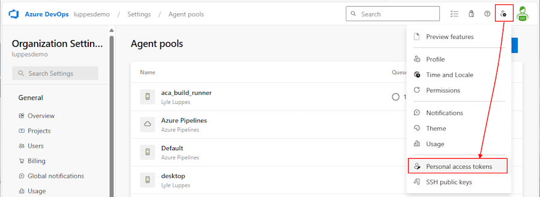
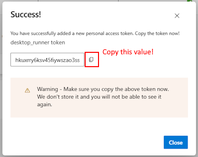

# Create a Self-Hosted Azure DevOps Container App Build Runner

This document will show you how to create a Azure Container Apps hosted Devops Build Runner.  Or, use these instructions to build an [Desktop Build Runner](../desktop-runner/README.md).

> Note: The ACA runner environment currently will only host ubuntu images, not Windows.

> Note: The DockerFile used here may or may not work for you! You may need to modify it to include the tools you need for your build process. Currently it does most of what you need for a .NET Core build, but it fails if you try to run the Advanced Security scans (not sure what's missing yet!). I will continue to update it as I have time and resolve issues.

## Steps to create a Container App Runner

1. [Create a PAT Token in Azure DevOps](#step-1-create-a-pat-token-in-azure-devops)
1. [Run your first pipeline](#step-2-create-an-agent-pool-to-be-linked-to-your-container-app)
1. [Create the Azure Container App Environment](#step-3-create-the-azure-container-app-environment)
1. [Create a Place Holder Job and Event Based Trigger Job](#step-4-create-a-place-holder-job-and-event-based-trigger-job)

---

### Step 1. Create a PAT Token in Azure DevOps

* Go to User Settings -> Personal Access Token -> then click on the New Token button
  

* Name the token `desktop_runner` and select your DevOps organization.  For purposes of this class, you can select `Full Access` for the scope.  Normally you would want to limit the scope to `Agent Pools (read, manage)`, `Build (read, execute)`, `Pipeline Resources (use, execute)`, `Release (read, write, execute)` and `Variable Groups (read)` or something similar, depending on what access your pipelines need.

  

* Once the token is created, be sure to copy that value off to somewhere like Notepad, as you will not be able to retrieve it again, and you will need it for the next steps

  

---

### Step 2. Create an Agent Pool to be linked to your Container App
  
* Go to Azure DevOps -> Organization Settings -> Pipelines: Agent Pools -> and click the Add Pool button

  

* Select Pool type of `Self-Hosted`, name the pool something like  `ubuntu-aca` or `aca_build_runner`, and uncheck `Auto-provision this agent pool in all projects`

  

* Click `Create` and you should see your new pool

  

---

### Step 3. Create the Azure Container App Environment

* Open a PowerShell window and run the [1_create_aca_environment.ps1](scripts/1_create_aca_environment.ps1) to create the ACA environment and ACR registry.

* Come up with a 3-5 character unique identifier for your environment (your initials?) and supply that as a parameter for the script.  This will be used as a prefix to create globally unique names for the resources.

* There are other parameters that default to the values in the script, but you can override them if you want.

#### Example 1

``` bash
./1_create_aca_environment.ps1 -UniqueId 'xxx'
```

---

### Step 4. Create a Place Holder Job and Event Based Trigger Job

* Open a PowerShell window and run [2_create_containerapp_job.ps1](scripts/2_create_containerapp_job.ps1) to create the job.

* Your Azure Organization Name will be the second node of the URL for your Azure DevOps Organization.  For instance, if your organization is `https://dev.azure.com/mycompany`, then your organization name is `mycompany`.

* The Token in this command is the PAT token you created in step 1.

* There are other parameters that default to the values in the script, but you can override them if you want.

* **Note:** This example will use the dockerfile `Dockerfile.pipelines` in the `docker` folder (which you can override with the -DockerFile parameter).  If you need your build server to have specific utilities, copy and modify the dockerfile to include those.

  * Please note that the ACA environment currently only supports **LINUX** build servers.

#### Example 2

``` bash
./2_create_containerapp_job.ps1 -UniqueId 'xxx' -OrgName 'mycompany' -PatToken 'xxxxx'
```

---

### Success!

That's it!  You should now have an Azure Container App that will scale up to as many instances as you need to run your own build jobs! You won't have to wait in a queue behind anyone else, and you can run your builds whenever you want by specifying `pool: > name: > aca_build_runner`!

---

## Reference

[Tutorial: Deploy self-hosted CI/CD runners and agents with Azure Container Apps jobs](https://learn.microsoft.com/en-us/azure/container-apps/tutorial-ci-cd-runners-jobs?tabs=bash&pivots=container-apps-jobs-self-hosted-ci-cd-azure-pipelines)

<!-- 
See also: https://medium.com/@nevincansel/create-containerized-build-agents-with-azure-devops-pipelines-e9384b3307de
-->
